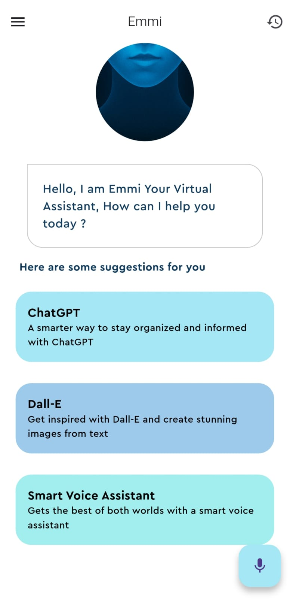
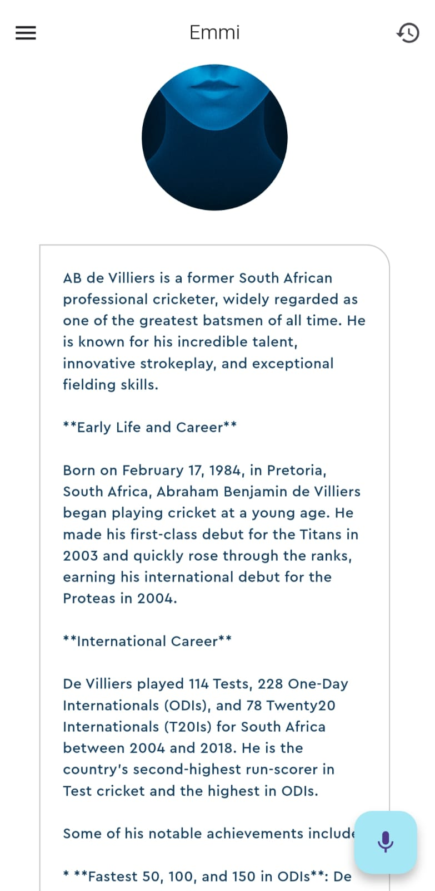

# 🤖 Emmi – AI Voice Assistant App  

An AI-powered **Voice Assistant App** built with **Flutter** during my **CodeClause Internship**.  
The app can **listen, think, and respond** to user queries using advanced AI models, and even **generate images from prompts**.  

---

## ✨ Features  

- 🎤 **Speech-to-Text** – Converts your voice into text commands.  
- 🗣️ **Text-to-Speech** – Responds naturally with voice output.  
- 🤖 **Groq AI (ChatGPT)** – Provides intelligent text-based responses.  
- 🎨 **Stability AI (Image Generation)** – Creates AI images from text/voice prompts.  
- 💾 **SQLite Database** – Saves and displays prompt history.  
- 🎭 **Smooth Animations & UI** – Clean and interactive user interface.  

---

## 📸 Screenshots  

| Home Page | Voice Input | AI Response | History Page |
|-----------|-------------|-------------|--------------|
|  |  |  |  |

## 🛠️ Tech Stack  

- **Flutter** (Dart) – Cross-platform mobile app framework  
- **speech_to_text** – For speech recognition  
- **flutter_tts** – For text-to-speech  
- **http** – For making API calls  
- **Groq AI API** – Text response generation  
- **Stability AI API** – Image generation  
- **SQLite** – Local database for storing history  

---

## 📂 Folder Structure  
lib/
│── main.dart
│── home_page.dart
│── history_page.dart
│── services/
│ ├── groq_service.dart
│ ├── db_helper.dart
│── widgets/
│ ├── feature_box.dart
│── utils/
│ ├── pallete.dart
assets/
│── images/
│ ├── virtualAssistant.png

⚡ Usage
Press the mic button 🎤 and speak your query.

The assistant will respond with text + voice.

If your query is related to images, Stability AI will generate an image.

All prompts & responses are saved in history 📜.

# Application LINK 
-  app-armeabi-v7a-release.apk

